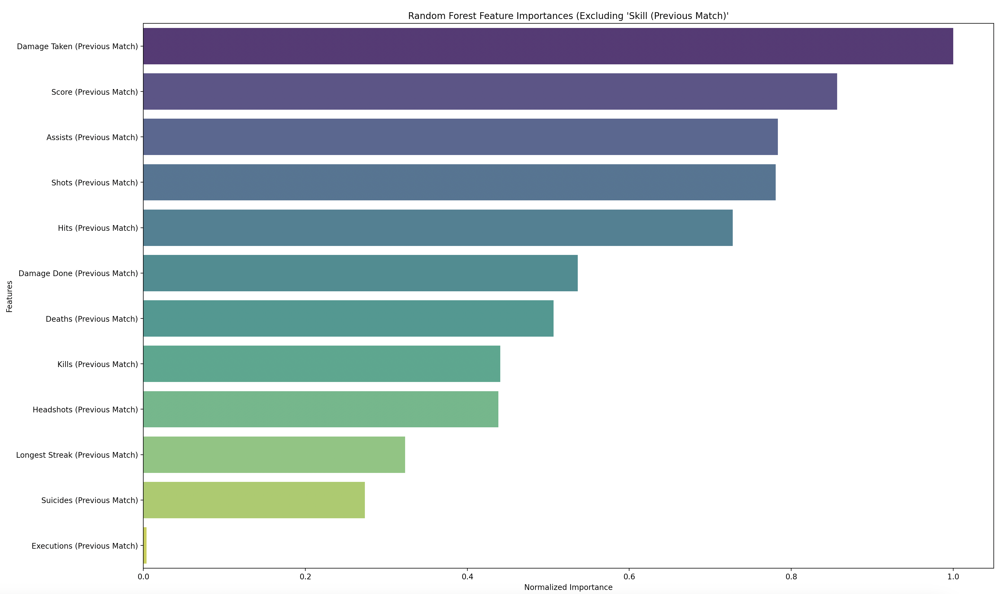
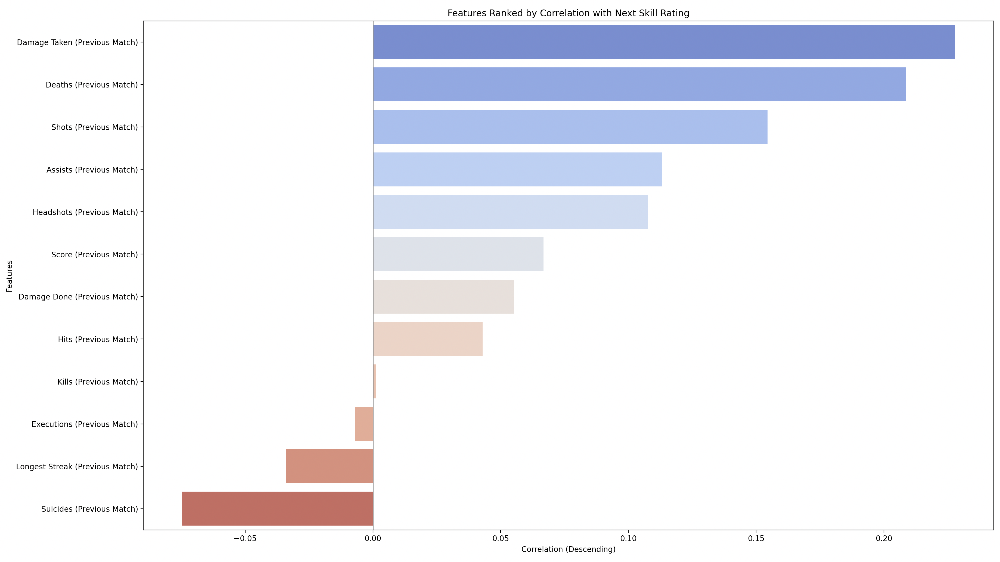
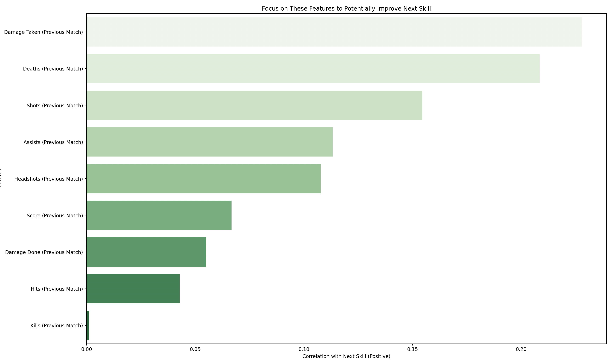

# COD Next-Skill Analysis

This repository contains a script that analyzes multiplayer Call of Duty match data to understand which factors from the **previous match** correlate most strongly with the **next match** skill rating. It also trains a Random Forest model (excluding `"Skill (Previous Match)"`) to highlight additional insights into feature importance.

## Inital Observations
### Random Forest Feature Importances

- **Damage Taken (Previous Match)** is the most important feature for predicting next-match skill.
- **Score (Previous Match)** and **Deaths (Previous Match)** are also significant.
- **Kills (Previous Match)** and **Shots (Previous Match)** are less important but still contribute.
- **Longest Streak (Previous Match)** and **Suicides (Previous Match)** are some of the least important.

### Stastical Correlations

- **Damage Taken (Previous Match)** has the highest positive correlation with next-match skill.
- **Deaths (Previous Match)** and **Score (Previous Match)** are also positively correlated.
- **Kills (Previous Match)** have a suprisingly low correlation with next-match skill.

### Correlations Table
| Feature                         | Correlation |
|---------------------------------|-------------|
| Damage Taken (Previous Match)   | 0.228       |
| Deaths (Previous Match)         | 0.209       |
| Shots (Previous Match)          | 0.154       |
| Assists (Previous Match)        | 0.113       |
| Headshots (Previous Match)      | 0.108       |
| Score (Previous Match)          | 0.067       |
| Damage Done (Previous Match)    | 0.055       |
| Hits (Previous Match)           | 0.043       |
| Kills (Previous Match)          | 0.001       |
| Executions (Previous Match)     | -0.007      |

### "What to Improve" Bar Chart

- **Damage Taken (Previous Match)** is the most positively correlated feature with next-match skill.
- **Deaths (Previous Match)** and **Shots (Previous Match)** are also positively correlated.
- **Kills (Previous Match)** has a very low positive correlation.

## Overview

1. **Data Cleaning & Preprocessing**  
   - Certain columns (e.g., XP, Armor, etc.) are removed before analysis because they're deemed irrelevant or overshadow other metrics.  
   - A “lag” feature is created by shifting each row by one, so we associate the previous match’s stats with the current match’s `Skill`.

2. **Random Forest Model (Excluding `"Skill (Previous Match)"`)**  
   - We train a Random Forest on the dataset **minus** the previous skill rating.  
   - This approach shows which other stats help predict the next match’s skill without that one factor dominating.

3. **Correlation Analysis**  
   - We compute Pearson correlations between each numeric feature (from the previous match) and the next match’s skill rating.  
   - We exclude `"Skill (Previous Match)"` from the correlation ranking, so it doesn’t eclipse everything else.

4. **Visualizations**  
   1. **Random Forest Feature Importances**: A bar chart showing which features the model deems most important, normalized to the highest importance = 1.0.  
   2. **Correlation Bar Chart**: Sorted from highest correlation to lowest correlation, illustrating which previous-match metrics are most strongly tied (positively or negatively) to next-match skill.  
   3. **Correlation Table**: A top-10 table in a matplotlib figure for quick scanning.  
   4. **“What to Improve” Bar Chart**: Highlights the top positively correlated features—those you might focus on boosting for a higher next-match skill rating.

5. **Top Positive & Negative Correlations (Console Output)**  
   - Prints the top 5 positive correlations (increasing skill) and top 5 negative correlations (decreasing skill).

## Requirements

- **Python 3.8+**
- **Libraries**:
  - `pandas`
  - `seaborn`
  - `matplotlib`
  - `scikit-learn`

## Project Structure
```bash
project_root/
   ├─ data/
   │   └─ multiplayer_match_data.csv # Your COD match data
   ├─ scripts/
   │   └─ run_analysis.py # Main script for analysis          
   └─ .README.md
```

## Setup & Execution

1. **Clone** this repository or copy the files to your local machine.
2. **Install** the required Python libraries from the `requirements.txt` file:
```bash
source venv/bin/activate  # On macOS/Linux
venv\Scripts\activate     # On Windows
pip install -r requirements.txt
```
3. Place your CSV file in the data/ directory. It should be named multiplayer_match_data.csv (or you can adjust the path in the script if you prefer another name).
4. **Run** the script:
```bash
python scripts/run_analysis.py
```

> **Note:** to run the script with your own data, copy your exported Account.html from Activision into the data/ directory as `Account.html` and run the script `extract_data_from_cod_html_report.py`. The script will parse the HTML file and save the match data as `multiplayer_match_data.csv`.

## Output & Findings

When the script runs, it produces:

1. **Random Forest Feature Importances**
    - Shows which previous-match metrics the Random Forest model deems most predictive of next-match skill, excluding "Skill (Previous Match)" from the training features.
    - Example top features might include “Damage Taken (Previous Match)” or “Score (Previous Match).”
2. **Correlation Bar Chart**
    - Ranks all the included previous-match metrics by their linear correlation with next-match skill (from most positive to most negative).
    - For example, “Damage Taken (Previous Match)” or “Deaths (Previous Match)” might rank highly, indicating that more damage taken is correlated with a higher next match skill (depending on the dataset’s dynamics).
3. **Correlation Table**
    - A top-10 table rendered as a matplotlib figure, listing each feature and its correlation value.
     -This table is also part of the script’s standard output.
4. **“What to Improve” Bar Chart**
    - Focuses on the top positive correlations (the features that, if increased, might correlate with increased next-match skill).
     - For instance, if “Shots (Previous Match)” is strongly positively correlated, it might suggest that improving your accuracy or taking more shots has some association with higher next-match skill.
5. **Console Logs**
    - The script prints out the top 5 positive correlation features and the top 5 negative correlation features.
    - “Positive” could be things you want to do more of, while “negative” might be things to avoid (like suicides).

## Contributing

Pull requests are welcome if you have ideas for additional features, better data cleaning, or advanced modeling approaches.